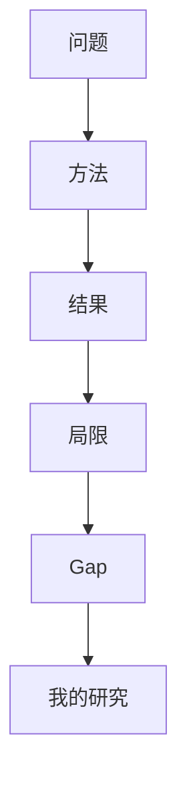

# 文献研究报告模板（11 章骨架）

> 用法：默认按此骨架输出，空章节直接省略。
> 快速/一页/组会模式只输出 1+3+4+6+7+11。

# 文献研究报告

## 1. 在研究什么

- 背景 / 核心问题 / 输入输出 / 任务 / 重要性 / 难点
- 一句话：利用 ___ 解决 ___ 条件下 ___ 问题

## 2. 研究到哪了

- 发展历程（因果链，不是时间线）
- 路线 A/B/C：核心思想 / 代表作 / 优势 / 局限 / 解决了前代什么 / 仍未解决什么

## 3. 共识 C1..Cn

格式：内容 / 支持论文（>=2 且独立团队） / 证据（跨数据集重复？） / 可信度[高/中/低]

## 4. 分歧 D1..Dn + 可能原因

格式：争议问题 / A 观点（论文+实验条件） / B 观点（论文+实验条件） /
实验差异（数据规模/分布/预处理/划分/指标/种子/泄漏？） / 有无定论 + 验证需要的实验

## 5. 技术水平与瓶颈

- 最好做到哪 / 成熟什么 / 未解决什么
- 数据 / 模型 / 理论 / 泛化 / 效率 / 落地瓶颈
- 成熟度：成熟[基本解决] / 竞争中[多路线 PK] / 开放[无稳定解] / 长期难题

## 6. Research Gap G1..Gn

格式：现有研究 / 存在问题 / 证据论文 / 为何未解决 / 可能方向 /
难度 / 价值 / 需什么数据模型 / 如何验证

标注 `[Real Gap]` / `[Fake Gap]`（`没人用A做B` 无特有缺陷论证 = Fake）

## 7. 对我的帮助

- MY_CONTEXT：{my_problem, my_stage, my_data, expected_output}
- 问题：哪些已充分（避坑），哪些仍值得做
- 方法：可直接用 / 可做 baseline / 可改进 / 可组合（A+B+新约束/数据/场景=新方法）
- 数据：别人用什么，你要准备什么、多少量、如何划分、是否需外部验证
- Baseline 梯度：传统 -> 经典深度 -> 主流 -> 强 SOTA -> 你的方法
- Metrics：必须用哪些，为什么不能只看 Accuracy，多指标如何互补
- 实验：主实验 + baseline 对比 + 消融 + 参数敏感 + 鲁棒 + 泛化/跨数据集 + 外部验证 + 复杂度 + 案例分析
- Pitfalls：逐条对应到具体论文教训

## 8. 下一步候选

每项：问题 / 不足 / 想法 / 方法 / 数据 / baseline / metrics / 实验 / 创新来源 / 风险

## 9. 文献矩阵

| 论文 | 年份 | 问题 | 数据 | 方法 | Baseline | Metrics | 关键结果 | 创新 | 局限 | 对我的帮助 |
|---|---|---|---|---|---|---|---|---|---|---|
| | | | | | | | | | | |

## 10. 路线图（Mermaid）

## 11. 总结（Q1/Q2/Q3 各 3-5 句）

- Q1 研究什么：
- Q2 研究到哪里了：
- Q3 对我有什么用：
